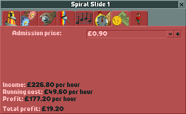

.. _rides:

Rides (wip)
======

Every well-functioning park in OpenRCT2 needs rides, without them a park would be just landscape with scenery and footpaths.

Finances
--------

Unless you are playing a scenario with "No money" setting turned on, building a ride costs money as well as running it costs money. This can be viewed: 

